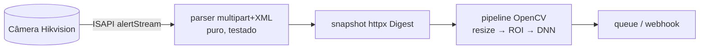

# isapi-event-vision

> **Daemon Python** que consome eventos Hikvision ISAPI, processa snapshots com OpenCV e classifica por pipeline.

[](https://github.com/abreu0x/isapi-event-vision/actions)
[](https://github.com/abreu0x/isapi-event-vision/releases)
[](LICENSE)

> **Status:** esqueleto em desenvolvimento. O **parser custom do alarm stream ISAPI**
> (multipart + XML, tolerante a variações de firmware) já está testado com cobertura
> 100% — sem câmera. Digest auth (httpx), pipeline OpenCV e config multi-câmera chegam
> nas próximas etapas.

## 🚀 Demo em 30s

```bash
uv sync --all-extras
uv run pytest          # ruff + mypy + testes, sem câmera
```

```python
from isapi_event_vision import parse_alert

parse_alert(b'''<EventNotificationAlert xmlns="http://www.hikvision.com/ver20/XMLSchema">
  <channelID>1</channelID><eventType>linedetection</eventType>
</EventNotificationAlert>''')
# → AlertEvent(event_type='linedetection', channel_id=1, ...)
```

## 🏗️ Architecture



O **parser é puro** (bytes → modelo), separado do transporte e da CV — testável sem
câmera e alvo natural de **fuzzing** (atheris) por consumir entrada de alta entropia.

## 🧪 Testes & CI

| Camada | Ferramenta | Status |
|--------|-----------|--------|
| Estilo & tipos | `ruff` + `mypy --strict` | ✅ em CI |
| Unit + cobertura | `pytest` (≥ 80%) | ✅ 100% |
| Mock server ISAPI | `respx` + fixtures XML | _planejado_ |
| Fuzzing do parser | `atheris` | _planejado_ |
| Snapshots de frame | `syrupy` | _planejado_ |

## 🗺️ Roadmap

- [x] Parser multipart + XML do alarm stream, testado (ruff/mypy/cov 100%)
- [ ] Cliente httpx com Digest auth + `respx` mock server
- [ ] Pipeline OpenCV (resize → ROI → MobileNet DNN) + config YAML multi-câmera
- [ ] `atheris` no parser + `syrupy` nos frames anotados

## 🛠️ Stack

Python 3.12 · Pydantic 2 · httpx (Digest) · OpenCV 4 · NumPy · structlog · pytest · ruff · mypy

## 📄 Licença

MIT — ver [LICENSE](LICENSE).
